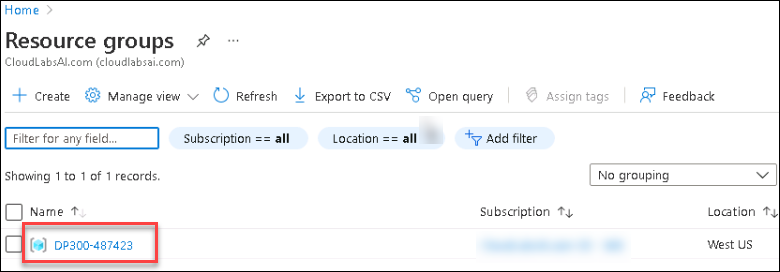
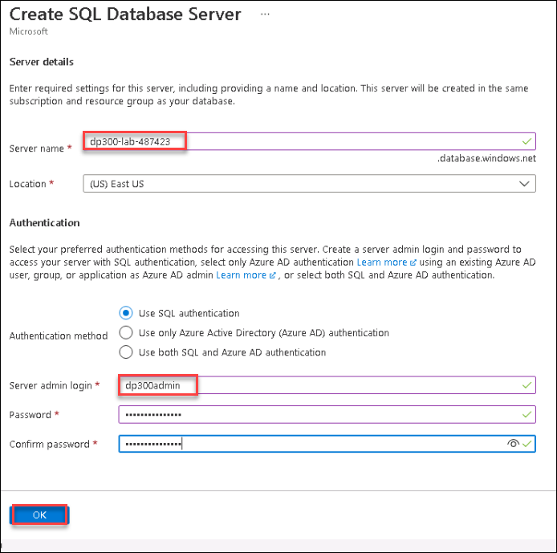
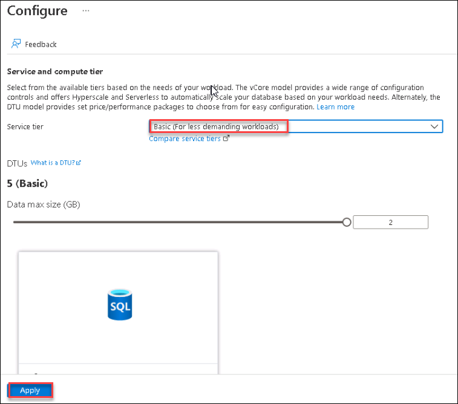
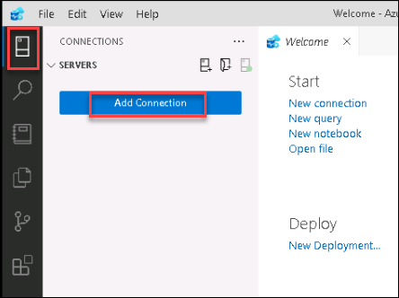
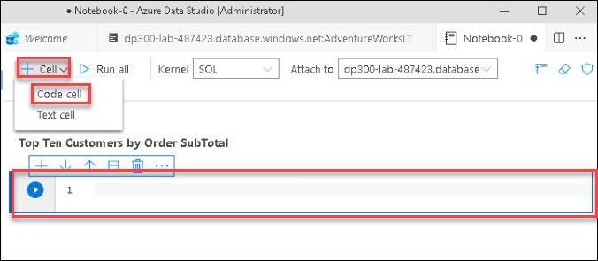
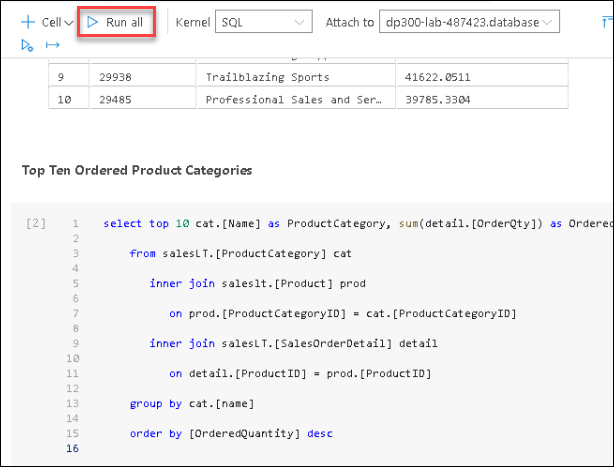

# Lab 2 – Deploying PaaS databases

**Estimated Completion Time:** 35-40 minutes

**Pre-requisites:** None

**Lab files:** None

# Lab Overview

The student will configure basic resources needed to deploy an Azure SQL Database with a Virtual Network Endpoint. Connectivity to the SQL Database will be validated using Azure Data Studio from the lab VM. Finally, an Azure Database for PostgreSQL will be created.

# Lab Objectives

The students will:

1. Configure basic resources

2. Deploy an Azure SQL Database 

3. Connect to Azure SQL Database with Azure Data Studio

4. Deploy an Azure Database for PostgreSQL

# Scenario

As a database administrator for AdventureWorks, you will set up a new SQL Database, including a Virtual Network Endpoint to increase and simplify the security of the deployment. Azure Data Studio will be used to evaluate the use of a SQL Notebook for data querying and results retention.

Finally, an Azure Database for PostgreSQL will be deployed to support additional data system needs.

# Exercise 1: Configure Basic Resources

## Task 1: Verify the pre-created resource group

1. Start a browser, and open the Azure Portal at [http://portal.azure.com](http://portal.azure.com/), logging in with the appropriate provided credentials

2. From the Home screen, click on the **Resource Groups** button  
‎
	

3. Review your existing Resource Group named **DP300-XXXXXX** that you will be using to deploy the resources in further tasks.  
‎
	

## Task 2: Create a Virtual Network

1. In the left navigation pane, click **Virtual Networks**  
‎
	

2. Click **+ Create** to open the **Create Virtual Network** page. On the **Basics** tab, complete the following information:

	- Subscription: **Select the lab subscription**

	- Resource Group: Select the existing **DP300-XXXXXX** Resource Group

	- Name: **Lab02-vnet**

	- Region: Select the same region where the Resource Group was created (the region nearest to your location)  
‎
	

	- Click the **Next: IP Addresses** button  
‎
	

3. Configure the virtual network’s IP range for the Azure SQL database endpoint

	- On the IP Addresses page, leave the defaults for the IPv4 address space.

	- Click on the **default** subnet. (Note that the Subnet address range you see might be different.)  
‎
	

	- In the Edit subnet flyout on the right, expand the Services drop-down, and tick **Microsoft.Sql**  
‎
	

	- Click **Save**

	- Click the **Review + Create** button, review the settings for the new virtual network, and then click **Create**

# Exercise 2: Deploy an Azure SQL Database

## Task 1: Deploy an Azure SQL Database

1. From the Azure Portal, click on **+ Create a Resource** at the top of the left side navigation bar  
‎
	

2. Search for “SQL databases” in the search box at the top, then click **SQL Databases** from the list of options  
‎
	

3. Click the **Create** button

4. Complete the Create SQL Database Basics screen with the following inputs and then click **Next: Networking**

	- Subscription: Select the lab subscription

	- Resource Group: Select the existing **DP300-XXXXXX** Resource Group

	- Database Name: **AdventureWorksLT**
	
	- Server: click **Create new.** In the New Server sidebar, complete the form as follows:

		- Server name: **dp300-lab-XXXXXX (lower case)&gt;** (server name must be globally unique)
		
		 
		  >**Replace XXXXXX with the Suffix value provided in the environment details page**.

		- Server admin login: **dp300admin**

		- Password: **dp300P@ssword!**

		- Confirm password: **dp300P@ssword!**

		- Location: Select the Region nearest to you (same as in Exercise 1)

		- Your New server sidebar should look similar to the one below. Click **OK**

		

        - Want to use Elastic Pool: **No**
        - Compute + Storage: Click **Configure database**

        - On the Configure screen, for Service tier dropdown, select **Basic**

          

	- Click **Basic**
        - Click the **Apply** button

**Note: Make note of this server name, and your login information. You will use it in subsequent labs.**

5. If you see the option **Backup storage redundancy**, keep the default value: **Geo-redundant backup storage**. 

6. Review settings and then click **Next: Networking**  
‎
	

7. On the Networking screen, for Connectivity method, click the **Private endpoint** radio button  
‎
	

8. Then click the **Add private endpoint** link under Private Endpoints  
‎
	

9. Complete the Create private endpoint flyout as follows:

	- Subscription: Ensure the lab subscription is selected

	- Resource group: Select the existing **DP300-XXXXXX** Resource Group

	- Location: The same Region that was selected for previous parts of this lab

	- Name: **DP-300-SQL-Endpoint**

	- Target sub-resource: **SqlServer**

	- Virtual network: **Lab02-vnet**

	- Subnet: **default (10.x.0.0/24)**

	- The Private DNS integration options can remain at the default

	- Review settings before clicking **OK**  
‎
	

10. Confirm the endpoint appears on the Networking page. 
‎
	

11. Click the **Next: Security** button. Leave the default _Enable Azure Defender for SQL_ **Not Now**. Then click the **Next: Additional settings** button.  

12. On the Additional Settings page, select the following options:

	- Set Use existing data to **Sample** 
‎
	

13. Click **Review + Create**

14. Review the settings before clicking **Create**

15. Once the deployment is complete, click the **Go to resource** button  
‎

## Task 2: Enable All Azure Services access to new SQL Server

1. From the SQL Database blade, click on the link for the Server name in the top section  
‎

	

2. On the SQL Server object’s navigation blade, click **Firewalls and virtual networks** under Security

	‎

3. Set Allow Azure services and resources to access this server to **Yes**  
‎

	

4. Click **Save**

 

# Exercise 3: Connect to Azure SQL Database

## Task 1: Register Azure SQL Database Instance in Azure Data Studio

1. Launch Azure Data Studio (ADS) from the lab VM provided.

	- You may see this pop-up at initial launch of Azure Data Studio. If you receive it, click **Yes**  
‎

2. When Azure Data Studio opens, click the **Connections** button in Azure Data Studio’s left sidebar, then the **Add Connection** button
	
	

3. In the **Connections** sidebar, fill out the Connection Details section with connection information to connect to the SQL database created in the previous Exercise

	- Connection Type: **Microsoft SQL Server**

	- Server: Enter the name of the SQL Server created in Exercise 2, Task 1. For example: **dp300-lab-xx.database.windows.net**  
	‎[Note that you were asked to create a server name with your Suffix provided in the Environment details page, instead of ‘xx’]

	- Authentication Type: **SQL Login**

	- User name: **dp300admin**

	- Password: **dp300P@ssword!**

	- Expand the Database drop-down to select **AdventureWorksLT.** 
	    - **NOTE:** You may be asked to add a firewall rule that allows your client IP access to this server. If you are asked to add a firewall rule, click on **Add account** and login to your Azure account. On Create new firewall screen rule screen, click **OK**.
		
	    
	    
    Back on the Connection sidebar, continue filling out the connection details:  
	
	- Server group will remain on **&lt;default&gt;**

	- Name (optional) can be populated with a friendly name of the database, if desired

	- Review settings and click **Connect**  
	‎

	

4. Azure Data Studio will connect to the database and show some basic information about the database, plus a partial list of objects  
‎
	

## Task 2: Query Azure SQL Database with a SQL Notebook

1. In Azure Data Studio, connected to this lab’s AdventureWorksLT database, click the **New Notebook** button  
‎
	

2. Click the **+Cell** drop down and select **Text Cell** button to add a new text box in the notebook. 

	


**Note:** Within the notebook you can embed plain text to explain queries or result sets.


3. Enter the text **Top Ten Customers by Order SubTotal**, making it Bold if desired  
‎
	

4. Click the **+Cell** drop down and then select **Code Cell** button to add a new cell at the end of the notebook to put a query in  
‎
	

5. Paste the following SQL statement into the new cell

```sql
select top 10 cust.[CustomerID], cust.[CompanyName], sum(sohead.[SubTotal]) as OverallOrderSubTotal

  from [SalesLT].[Customer] cust

    inner join [SalesLT].[SalesOrderHeader] sohead

        on sohead.[CustomerID] = cust.[CustomerID]

   group by cust.[CustomerID], cust.[CompanyName]

   order by [OverallOrderSubTotal] desc
   ```

6. Click on the blue circle with the arrow(**Run cell** button) to execute the query. Note how the results are included within the cell with the query.

7. Click the **+Cell** drop down and select **Text Cell** to add a new text cell.

8. Enter the text **Top Ten Ordered Product Categories**, making it Bold if desired

9. Click the **+Cell** drop down and select **Code Cell**  add a new code cell, and paste the following SQL statement into the cell

```sql
select top 10 cat.[Name] as ProductCategory, sum(detail.[OrderQty]) as OrderedQuantity

	from salesLT.[ProductCategory] cat

	   inner join saleslt.[Product] prod
      
	      on prod.[ProductCategoryID] = cat.[ProductCategoryID]

	   inner join salesLT.[SalesOrderDetail] detail

	      on detail.[ProductID] = prod.[ProductID]

	group by cat.[name]

	order by [OrderedQuantity] desc
```
10.  Click on the blue circle with the arrow (**Run cell** button) to execute the query 

11. To run all cells in the notebook and present results, click the **Run All** button in the toolbar  
‎
	

12. Within Azure Data Studio save the notebook from File menu (either Save or Save As) to the D:\Labfiles\Deploy Azure SQL Database (this folder already exists on the VM) directory. Close the tab for the Notebook from inside of Azure Data Studio. From the File Menu, select Open File, and open the notebook you just saved. Observe that query results were saved along with the queries in the notebook.

# Exercise 4: Deploy an Azure Database for PostgreSQL Database

## Task 1: Deploy a PostgreSQL Database

1. From the Azure Portal, click on **+ Create a Resource** at the top of the left side navigation bar

	

2. Search for “postgresql” in the search box at the top, then click **Azure Database for PostgreSQL** in the results  
‎
	

3. Click the **Create** button

4. Click **Create** for the Single Server option  
‎
	

5. Complete the Single Server Basics screen with the following inputs:

	- Subscription: Select the lab subscription

	- Resource Group: Select the existing resource group **DP300-XXXXXX**

	- Server Name: **dp300-lab02-XXXXXX** (server name must be unique)
         
	
	  >**Replace XXXXXX with the Suffix value provided in the environment details page**.
         
	- Data source: **None**

	- Location: Select the Region closest to you, which has been used throughout this lab

	- Version: **10** or **11**

	- Click the **Configure Server** link under Compute + Storage

		- Click the **Basic** tab

		- Slide the vCore slider all the way to the left to select **1 vCore**  
‎
	

        - Click **OK**

	- Admin username: **dp300admin**

	- Password: **dp300P@ssword!**

	- Confirm password: **dp300P@ssword!**  
	‎

6. Click **Review + Create**

7. Review the settings and click **Create**

8. When the deployment is complete, click **Go to resource**

## Task 2: Enable All Azure Services Access to PostgreSQL Database

1. Click on the **Connection security** button under Settings in the database’s sidebar  
‎
	

2. Slide the Allow access to Azure services setting to **Yes**.  Click **+ Add client IP**, then **Save**.  
‎
	

3. After saving, click on the **Add client IP** button again at the top right to add your client IP to the firewall.

	

4. Click **Save** at the top left.

## Task 3: Connect to the PostgreSQL Database with Azure Data Studio

**Note:** With the PostgreSQL extension installed to Azure Data Studio, PostgreSQL can be queried. This extension is pre-installed on the lab VM.


1. In Azure Data Studio on the lab VM, ensure the Connections sidebar is expanded—Click the **Connections** button in the left nav bar, if not.

2. Click the **New Connection** button  
‎
	

3. In the Connection Details sidebar, enter the following information to connect to the previous Task’s PostgreSQL database:

	- Connection Type: **PostgreSQL**

	- Server: Enter the name of the PostgreSQL Server you created in Task 1. For example: **dp300-lab02-xx.postgres.database.azure.com** (You can find the full name of the Postgre server in the Overview pane in the portal. You'll probably need to replace xx with the specific letters you added. )

	- Authentication Type: **Password**

	- User name: **dp300admin@dp300-lab02-xx** (note that the user name must include the first part of the hostname that you specified above; use your suffix instead of 'xx'. The admin username can also be found on the Overview pane in the portal.) 

	- Password: **dp300P@ssword!**

	- Database Name will remain on **&lt;default&gt;**

	- Server group will remain on **&lt;default&gt;**

	- Name (optional) can be populated with a friendly name of the database, if desired

4. Review settings  
‎
	

5. Click **Connect**

6. Note Azure Data Studio’s connection to the PostgreSQL database  
‎
	

 7. Click on **Next** from the bottom right corner and follow the instructions to perform the next lab.

 
