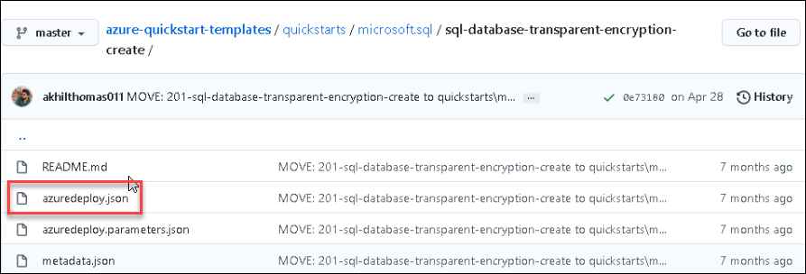
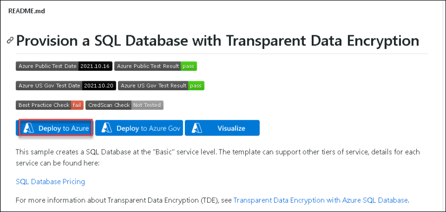
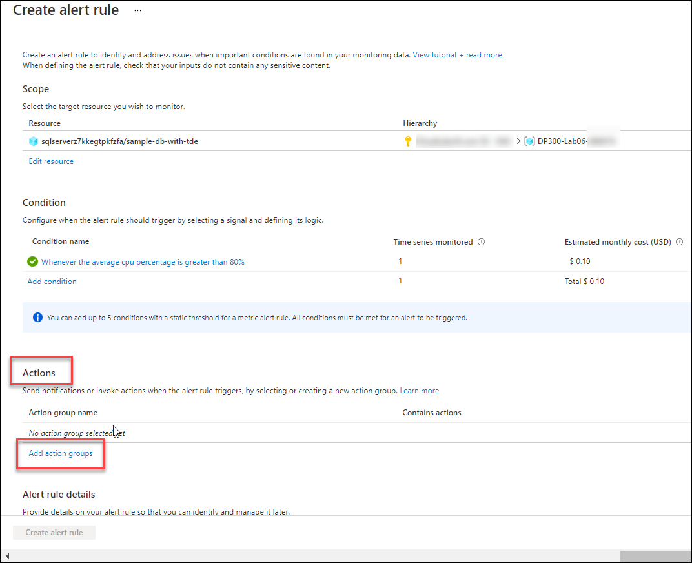
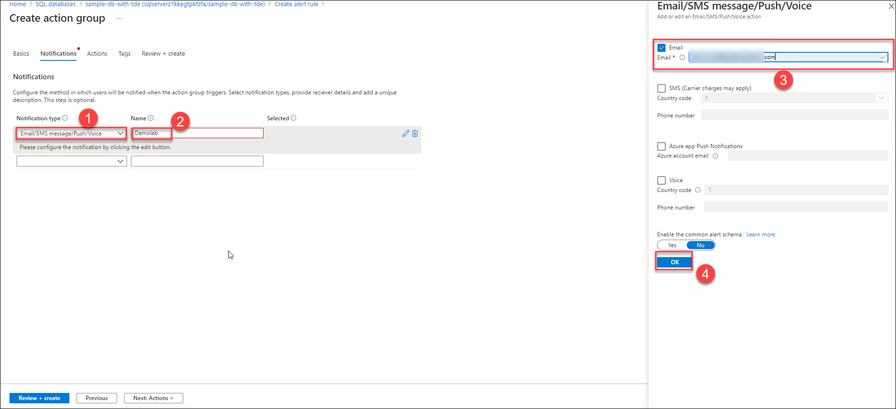
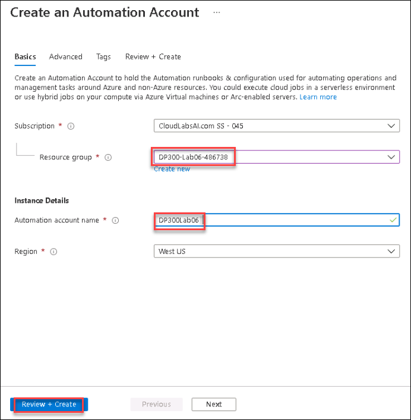
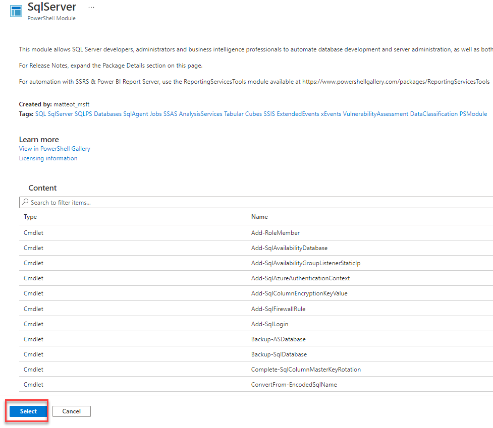
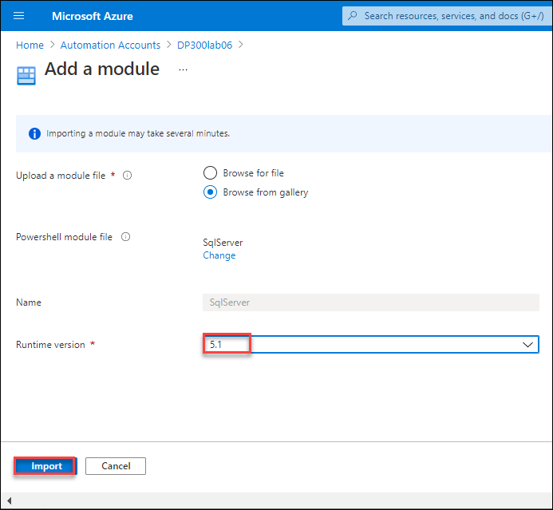
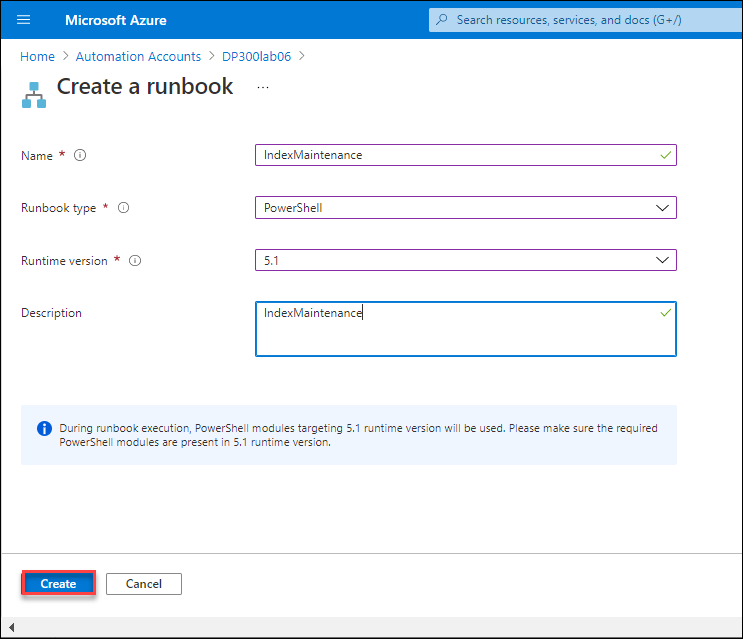

# Lab 6 – Automate Resources

**Estimated Time**: 90 minutes

Note: The Microsoft.Insights module needs to be added to your subscription in order to complete this lab and it is already registered for your environment.

**Lab files**: The files for this lab are in the C:\LabFiles\DP-300T00-Administering-Relational-Databases-on-Azure\Allfiles\Labs\Automate Resources folder.

# Lab overview

You will take the information gained in the lessons to configure and subsequently implement automate processes within AdventureWorks. 

# Lab objectives

After completing this lab, you will be able to:

- Deploy an Azure resource from a GitHub Quickstart template

- Configure performance metric related notifications

- Deploy an Azure Automation Runbook to perform index maintenance in an Azure SQL Database

# Scenario

You have been hired as a Senior Data Engineer to help automate day to day operations of database administration. This automation is to help ensure that the databases for AdventureWorks continue to operate at peak performance as well as provide methods for alerting based on certain criteria. AdventureWorks utilizes SQL Server in both Infrastructure as a Service and Platform as a Service offerings. 

 
# Exercise 1: Deploy an Azure Quickstart Template 

Estimated Time: 30 minutes

Individual Exercise

The main task for this exercise are as follows:

- Deploy an Azure resource from a GitHub Quickstart template

## Task: Deploy an Azure SQL Database from a template

1. Navigate to the following GitHub repository using a web browser. 

    [https://github.com/Azure/azure-quickstart-templates/tree/master/quickstarts/microsoft.sql/sql-database-transparent-encryption-create](https://github.com/Azure/azure-quickstart-templates/tree/master/quickstarts/microsoft.sql/sql-database-transparent-encryption-create)

 
    

    Click on **azuredeploy.json**, and review the file. 

2. Navigate back to the above link (click the back arrow in the top left of the browser), and click on the **Deploy to Azure** button. You may be prompted to login to the Azure portal if you have not already logged in. Login with your supplied lab credentials from the Environment details tab.

   If you see the pop-up, click Skip for now(14 days until this is required).

    

3. You will see a screen like the one below. In order to deploy this template, you need to complete the blank fields.

    In the Resource Group field, select the existing resource group **DP300-Lab06** from the drop down menu. Change the region to a region near you. For the remaining fields, use the following values:   
    
	- SQL Administrator Login: **labadmin**
	- SQL Administrator Login Password: **Azur3Pa$$** 
	- Transparent Data Encryption: **Enabled** 
	- Location: **[resourceGroup().location]** 

     

4. Click **Review + create**, then click **Create**. Your deployment will begin. You can track the status of your deployment by clicking the bell (highlighted in the screenshot below) and then clicking on the **Deployment in progress** link in the Notifications pane.

   

   Your deployment will take approximately 5-10 minutes to deploy. If you have clicked on the link above, you will be able to track your deployment. 

   

5. Upon completion, the screen will update with a link to your newly created resource. 

   

   Click on the **Go to resource group** link. You will be taken to the Azure Resource Group your deployment just created. You should see both a **SQL server and a SQL database** in the Resource group.  Make note of the name of your SQL server, as you will it in the next exercise.

  

## Exercise 2: Configure Performance Metrics Based Alerts

Estimated Time: 30 minutes

Individual Exercise

The main task for this exercise is as follows:

- Configure performance metric related notifications

## Task: Creating an alert when CPU exceeds an average of 80 percent.

1. Navigate to portal.azure.com if you are not already there. You may need to login again. In the search bar at the top of the Azure Portal, type SQL, and click on **SQL databases**. Click on the database name: **sample-db-with-tde**.

    

2. On the main blade for the sample-db-with-tde database, navigate down to the **Monitoring** section 

3. Click on **Alerts** as shown below.

    

4.  You'll see the screen below. Click on **+ +Create then select Alert rulet** rule.

    

 

5. You will notice that the resource is already populated for you with the SQL Server you created. Under the **Condition** section, click **Add condition**.

  

6. In the Configure signal logic fly out menu, select **CPU percentage**. 

    

7. Supply a threshold value of **80**. Click Done.

    

8. Under the **Actions** section, click **Add action groups**

    
    

9. In the fly out for Action group, Click **+ Create action group**.

  

   In the Create action group screen, type: 
   - Action group name: **emailgroup** 
   - Display name: **emailgroup**

   

   Select **Next: Notifications >**.
    
10. Then click on the drop down **Notification type** and select **Email/SMS message/Push/Voice** and enter the name **DemoLab**.

    

11. In the flyout screen on the right (shown in the image above), click the check box next to email, enter an email address and click **OK**. Then click on the **Review + create** button, and then click **Create** on the Create action group screen.

    From the Create alert rule screen, go to detail tab and add an Alert rule with the name **DemoAlert**, and then click **Create alert rule** as show below.
    
    

 
# Exercise 3: Deploy an Automation Runbook

Estimated Time: 30 minutes

Individual Exercise

The main tasks for this exercise are as follows:

- Deploy a maintenance task script.

- Deploy an Azure Automation Runbook to perform index maintenance in an Azure SQL Database

## Task: Deploy an Automation Runbook to rebuild indexes in an Azure SQL Database.

1. From the lab virtual machine, if you are not in the Azure portal, start a browser session and navigate to [https://portal.azure.com](https://portal.azure.com/). Provide appropriate credentials. 

    

2. In the Azure Portal in the search bar type Automation and then click on **Automation Accounts**

    

    Click on the **+ Create** button in the portal.
 
    

3. Create your automation account

    

   Name: **DP300Lab06**

   Resource Group: Use the existing resource group **DP300-Lab06**

   Location: Use the region in which you created your Azure SQL server in Lab 2

   Click on **Review+Create** and then Click on **Create**. Your automation account should deploy in 1-3 minutes. 

4. Navigate to the **github** page for AdaptativeIndexDefragmentation. [https://github.com/microsoft/tigertoolbox/blob/master/AdaptiveIndexDefrag/usp_AdaptiveIndexDefrag.sql](https://github.com/microsoft/tigertoolbox/blob/master/AdaptiveIndexDefrag/usp_AdaptiveIndexDefrag.sql)

    

 
    Click on **Raw**. This will provide the code in a format where you can copy it. Select all of the text (Ctrl-A) and copy it to your clipboard (Crtl-C). 

5. In the Azure Portal, navigate back to your SQL database and click on the **Query editor** as shown below.

    

6. You will be prompted for credentials to login to your database. Use the credentials you created in Exercise 1 and click on **Ok**
   
   **Login**: labadmin    
   **Password**: Azur3Pa$$

    When you try to log in, you may receive an error about a Whitelist IP. Click on the blue **Whitelist IP** link at the end of the error message. Doing so will update server firewall rules to allow access.

    

7. After you see a success message, click **OK** on the log in screen again. This time you should be granted access to SQL Database Query Editor. 

8. In the query editor, paste the text you copied earlier in this task from GitHub into the Query 1 pane. Delete the **USE msdb** and **GO** statements on lines 5 and 6 of the script.

    

9. Click **Run**. The query should result in the following message: 

    

10. In the Azure portal, type automation within the search field. Click on **Automation Accounts**. 

    

    Identity the automation account that has been created in your subscription and click on it.

    

12. Select **Modules** from the Shared Resources section of the Automation blade. 

    

13. Click on **Browse Gallery**

    

14. Search for sqlserver within the Gallery

    

15. Click on the SqlServer text which will direct to the next screen. Click on **Select**.
    

16.  Select the Runtime version as **5.1** from the drop down menu and then Click on **Import** in the bottom corner of the screen in order to import the module. This will import the PowerShell module into your Automation account.
    

17. You will need to create a credential to securely login to your database. From the Automation Account blade navigate to the Shared Resources Section and click **Credentials**.

    

18. Click **+ Add a credential**, and then create a credential as shown below:
    - Name: **SQLUser** 
    - Username: **labadmin** 
    - Password: **Azur3Pa$$** 
    
    Click **Create**.

    

19. Scroll to the **Process Automation** section of the Automation account blade and click on **Runbooks** and then **+ Create a runbook**.

    

20. In the Create a a runbook panel, enter: 
    - Name: **IndexMaintenance** 
    - Runbook Type: **Powershell**
    - RunTime Version: **5.1** 
    - Description: You can supply a short description of your choosing. 
    Click **Create**. 

    

    Once the runbook has been created, the process should drop you directly into the runbook.   

21. Use File Explorer within the labvm to navigate to the folder C:\LabFiles\DP-300T00-Administering-Relational-Databases-on-Azure\Allfiles\Labs\Automate Resources folder. Right click on the **DP300-Lab-Module-6.ps1** file, and click **Edit**. The PowerShell IDE will open.

    
    
22. Edit the **$AzureSQLServerName** variable to reflect the name of your Azure SQL server. You can get this value from the overview screen of your Azure SQL Database as shown below.

    

23. Copy the name of the server including the .database.windows.net domain suffix. 

    

24. On Line 1 of the file paste in your server name. Select all of the text and copy it to your clipboard. 

25. Navigate back to your automation runbook, and paste in the PowerShell code you copied from the PowerShell IDE. Then click **Save** and then click **Publish**.

    

26. Click Yes if prompted to over-write any previously published versions. 

    

27. Next you will schedule the runbook to execute on a regular basis. Click on **Schedules** in the left hand navigation menu. Then click on **+ Add a schedule** at the top. 

    

28. Click on **Link a schedule to your runbook**. 
    
    

29. Select **+ Add a schedule**. 

    

30. Supply a descriptive schedule name and a description if desired. 

31. Specify the start time of 4:00AM of the following day and in the Eastern Time zone. Configure the reoccurrence for every 1 Day. Do not set an expiration. 

    

32.  Click **Create**. Click **OK**. 

33. The schedule is now linked to the runbook. 

    

 

 

 

 

 
